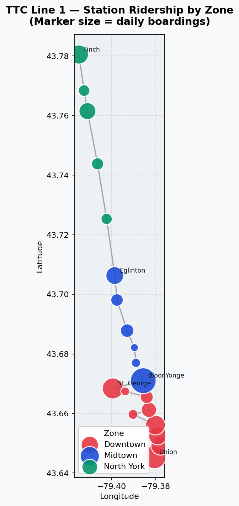

# Toronto Transit GIS — Line 1 Ridership Map

An interactive geospatial visualization of the Toronto Transit Commission (TTC)
Line 1 subway network, plotting 20 stations with real latitude/longitude
coordinates and symbolizing them by daily ridership and service zone.



## Overview

This project demonstrates a foundational GIS workflow in pure Python: load
coordinate-based data, classify features into geographic zones, apply
data-driven symbology, and aggregate spatial statistics by region.

Stations are grouped into three zones — **Downtown**, **Midtown**, and
**North York** — with marker size scaled to approximate daily boardings.
A simple spatial summary then aggregates ridership by zone to surface where
the network carries the most demand.

## Features

- **Coordinate-based data handling** — 20 real TTC Line 1 stations loaded as a pandas DataFrame
- **Categorical classification** — stations grouped into three service zones
- **Data-driven symbology** — marker color by zone, marker radius scaled to ridership
- **Spatial aggregation** — ridership totals and averages computed per zone
- **Interactive output** — pan, zoom, marker clustering, and clickable popups via Folium
- **Static export** — a matplotlib PNG version for reports and documentation

## Tech stack

- Python 3
- [pandas](https://pandas.pydata.org/) — tabular data handling
- [Folium](https://python-visualization.github.io/folium/) — interactive Leaflet-based maps
- [Matplotlib](https://matplotlib.org/) — static map export

## Quick start

```bash
# 1. Install dependencies
pip install pandas folium matplotlib

# 2. Run the script
python toronto_transit_map.py

# 3. Open the generated interactive map
open toronto_transit_map.html    # macOS
# or just double-click the file
```

## Sample output

Ridership summary produced by the script:

| Zone       | Stations | Avg Daily Riders | Total Daily Riders |
|------------|:--------:|:----------------:|:------------------:|
| Downtown   |    9     |      41,778      |      376,000       |
| Midtown    |    6     |      34,833      |      209,000       |
| North York |    5     |      30,200      |      151,000       |

Downtown carries roughly half of Line 1's total daily ridership across only
nine stations, confirming its role as the network's demand core.

## Data notes

Station coordinates are accurate. Ridership figures are approximate daily
boardings used for illustration and visualization purposes only, not
official TTC statistics.

## Next steps

- Replace sample ridership with official TTC open data
- Add Line 2 (Bloor–Danforth) and extend the zone classification
- Compute nearest-station catchment areas using a distance-based buffer
- Port the workflow to ArcGIS Pro / ArcGIS Online for comparison

## Author

**Hamza Faruqui** — Computer Science, University of Toronto
